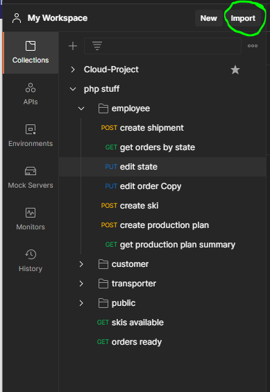
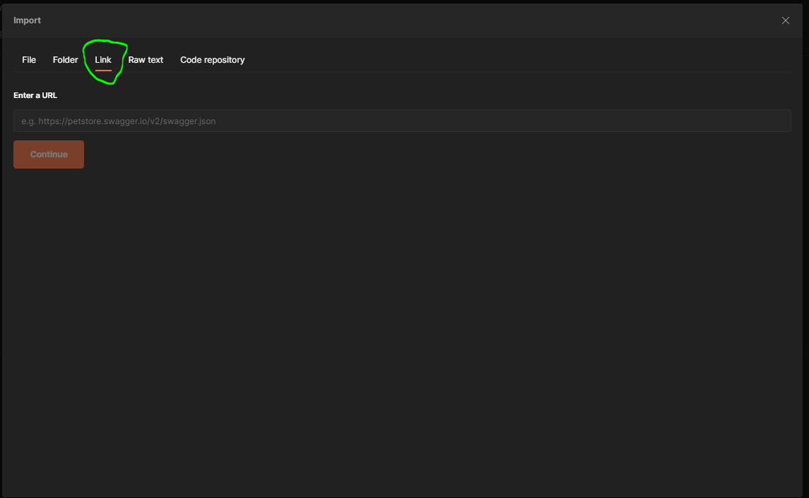
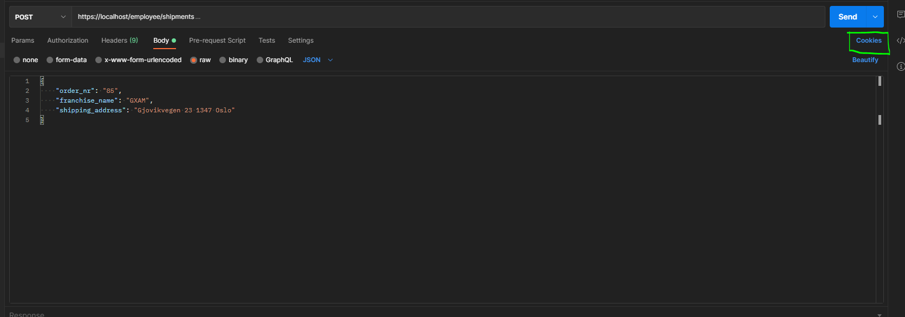
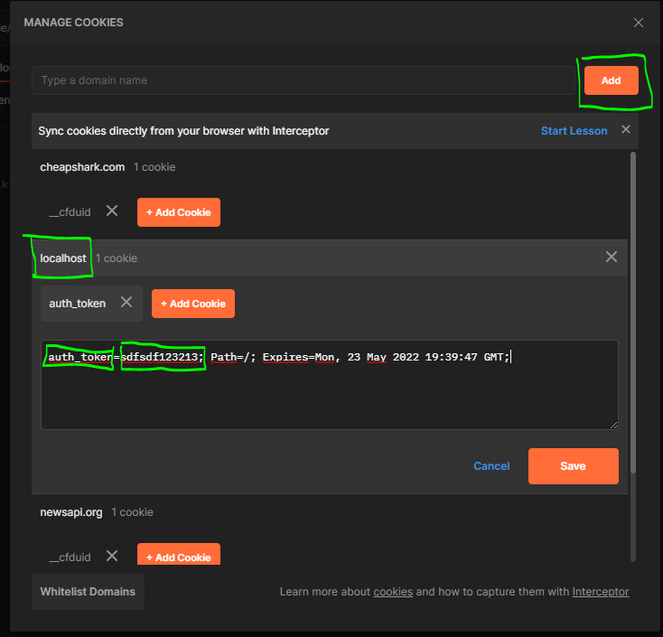

# DatabaseProject

In this project we have developed a database system with php PDO and mysql that handles a ski factory exposing endpoints for various users. As well as having created the php rest api based on the specification given we have also created an EER, logical model and the queries for creating the database with data for MariaDB.

Work done by **Jørgen Eriksen** and **Elvis Arifagic**.

# Struture of this repo
In the folder "non-code-stuff" you can find the following:
1. EER-Diagram
2. PDF with the logical model, queries for database creation, writing about tests, endpoint descriptions.
3. The implemented database in .sql format.

The code of the rest api can be found in the ejAPI folder.


# Setting up the api locally for windows
For the purposes of this repository we will define the layout for a windows deployment:
1. Download XAMPP installer from here: [xampp download](https://www.apachefriends.org/index.html)
2. Download Postman Client from here: [postman download](https://www.postman.com/downloads/)
3. Install XAMPP and check that you have a htdocs folder on your system, default folder location is: C:/xampp/htdocs
4. Clone this repository **into the htdocs** folder
5. We have supplied you with a .htaccess file in the non-code folder in this repo, copy this into the htdocs folder. Such that you know have:  

```
xampp   
│
└──htdocs  
   | databaseproject  
   | .htaccess  
```

6. Configure the file dbCredentials.php to whatever password and username you wish, if you change this you need to change the same fields in **api.suite.yml and unit.suite.yml**
7. Start XAMPP and start apache webserver and mysql server for phpmyadmin.
8. Now to get the endpoints and bodies, **start Postman**, click import in the top left and then click on link and enter this: https://www.getpostman.com/collections/20c6fc58f4f72ecd06bf  
   
   
9. Next you need to configure the cookies. Open phpmyadmin and check the auth_token table. Copy the token you would need and go back to Postman. You need to create a domain name called localhost and add the following cookie like this:
   
  

10. Now you are ready to use all of the endpoints and everything should work! 

# Using the api endpoints, needed bodies and cookies
## Employee (https://localhost/ejAPI/v1.0/employee/...):
    customer_rep
    storekeeper
    production_planner

### https://localhost/ejAPI/v1.0/employee/shipments (POST,Customer rep)

Description: Create a shipment
Example request: http://localhost/ejAPI/v1.0/employee/shipments <br />
Example body: <br />
```json
{
    "order_nr": "85",
    "franchise_name": "GXAM",
    "shipping_address": "Gjovikvegen 23 1347 Oslo"
}
```

### http://localhost/ejAPI/v1.0/employee/orders{?state=state} (GET,Customer rep)  

Description: Get an order from the database based on it's current state  
Example request: http://localhost/ejAPI/v1.0/employee/orders?state=open <br />  

### https://localhost/ejAPI/v1.0/employee/modifystate/{:order_nr} (PUT, Customer rep)  

Description: Modify the state of an order in the database.  
Example request: http://localhost/ejAPI/v1.0/employee/shipments <br />  
Example body: <br />  
```json  
{
    "created_employee_nr": "2"
}
```

### https://localhost/ejAPI/v1.0/employee/skiis (POST, storekeeper)
Description: Creates a skis in the database.  
Example request: http://localhost/ejAPI/v1.0/employee/skiis <br />  
Example body: <br />  
```json  
{
    "model": "Race Pro",
    "type_of_skiing": "classic",
    "temperature": "0",
    "grip_system": "grip_system",
    "size": "197",
    "weight_class": "80-90",
    "description": "description",
    "historical": "1",
    "photo_url": "https://i1.adis.ws/i/madshus/madshus_1920_race-speed-skate?w=412&fmt=webp&bg=white&protocol=https&dpi=72",
    "msrpp": "6200"
}
```

### http://localhost/ejAPI/v1.0/employee/orders{?state=state} (GET, storekeeper)
Description: Get skis in the skis_available state as a storekeeper.  
Example request: http://localhost/ejAPI/v1.0/employee/orders?state=skis_available <br />  


### http://localhost/ejAPI/v1.0/employee/modifystate/{:order_nr} (GET, storekeeper)
Description: Modify the state of a ski as a storekeeper.
Example request: https://localhost/ejAPI/v1.0/employee/modifystate/67 <br />  

### http://localhost/ejAPI/v1.0/employee/productionplans (GET, production planner)
Description: Upload a production plan
Example request: https://localhost/employee/modifystate/67 <br />  
Example body: <br />  
```json  
{
    "plan_name": "super plan4",
    "responsible_employee_nr": 3,
    "skiis": [
        {
            "product_id": 1,
            "number_of_skiis": 7
        },
        {
            "product_id": 2,
            "number_of_skiis": 8
        }
    ]
}
```

## Customer(http://localhost/ejAPI/v1.0/customer/...)

### http://localhost/ejAPI/v1.0/customer/orders/{:customer_nr}{?since=date} (GET)

Description: Gets all the orders to the customer after the since date (optional)
Example request: http://localhost/ejAPI/v1.0/customer/orders/2 <br />
Example request with optional parameter: http://localhost/ejAPI/v1.0/customer/orders/2?since=2020-04-04 <br />
Example response: <br />
```json
[
    {
        "customer_id": "2",
        "order_nr": "2",
        "state_value": "3",
        "skiis": [
            {
                "product_id": "1",
                "model": "Active",
                "type_of_skiing": "skate",
                "temperature": "0",
                "grip_system": "wax",
                "size": "197",
                "weight_class": "60-70",
                "description": "For active persons.",
                "historical": "1",
                "photo_url": "https://i1.adis.ws/i/madshus/madshus_1920_race-speed-skate?w=412&fmt=webp&bg=white&protocol=https&dpi=72",
                "msrpp": "4500",
                "skiis_ordered": "6",
                "skiis_ready": "3"
            },
            {
                "product_id": "2",
                "model": "Race Pro",
                "type_of_skiing": "classic",
                "temperature": "0",
                "grip_system": "IntelliGrip",
                "size": "192",
                "weight_class": "70-80",
                "description": "for people with style.",
                "historical": "1",
                "photo_url": "https://encrypted-tbn0.gstatic.com/images?q=tbn:ANd9GcSKmqhn2yubXLTfZDr3RQLON7a9NGKHSNu6AQ&usqp=CAU",
                "msrpp": "5600",
                "skiis_ordered": "6",
                "skiis_ready": "4"
            }
        ],
        "state_name": "skis available"
    },
]
```

### http://localhost/ejAPI/v1.0/customer/orders (POST)

Example request: http://localhost/ejAPI/v1.0/customer/orders <br />
Example Body: <br />
```json
{
    "customer_id": "2",
    "skiis": [
        {
        "product_id": "1",
        "skiis_ordered": "5"
        },
                {
        "product_id": "2",
        "skiis_ordered": "6"
        }
    ]
}
```

### http://localhost/customer/ejAPI/v1.0/orders/split/{:order_nr} (PUT)

Description: splits the order, so one order get all the skis ready, and the other order with the remaining skis needed for the order.
Example request: http://localhost/ejAPI/v1.0/customer/orders/split/72 <br />
Example Body: <br />
```json
{
    "created_employee_nr": "2"
}
```


### http://localhost/ejAPI/v1.0/customer/orders/{:order_nr} (DELETE)  

Description: Deletes the order  
Example request: http://localhost/ejAPI/v1.0/customer/orders/82 <br />  

## Transporter(http://localhost/ejAPI/v1.0/transporter/...)  

### http://localhost/ejAPI/v1.0/transporter/orders (GET)  

Description: Gets all orders ready to be shipped  
Example request: http://localhost/ejAPI/v1.0/transporter/orders <br />  


### http://localhost/ejAPI/v1.0/transporter/orders/{:order_nr} (PUT)

Description: set transporter detail for shipping and updates order to state 'shipped'
Example request: http://localhost/ejAPI/v1.0/transporter/orders/5 <br />
Example body: <br />
```json
{
    "transporter_name": "LHD",
    "driver_id": "2",
    "created_employee_nr": 2
}
```

## Public(http://localhost/ejAPI/v1.0/public/...)  

### http://localhost/ejAPI/v1.0/public/skiis{?model=name} (GET)

Description: get all 
Example request: http://localhost/ejAPI/v1.0/public/skiis <br />
Example request with optional parameter: http://localhost/ejAPI/v1.0/public/skiis?model=Active<br />
Example body: <br />
```json
[
    {
        "model": "Active",
        "type_of_skiing": "skate",
        "temperature": "0",
        "grip_system": "wax",
        "size": "197",
        "weight_class": "60-70",
        "description": "For active persons.",
        "historical": "1",
        "photo_url": "https://i1.adis.ws/i/madshus/madshus_1920_race-speed-skate?w=412&fmt=webp&bg=white&protocol=https&dpi=72",
        "msrpp": "4500"
    }
]
```

# Assumptions/feedback
One of our feedback where:
> 'If one order is of many skiis with different types of ski, temperatures, and size. How can you make sure that on ski can get all of these out without making it redundant. 

How we have structured it, if the skiis have different size/temperatures, that would create a new product with new product ID for each different type of skiis. So that means, even if some types of skiis are the same, but the only difference is the temperatures or/and size, then those skiis would have a unique rows in the skiis table.

Even though Transporter is a customer, it makes more sense to make it not a member of customer in the database structure, as it is a completly different kind of customer then stores, franchises and team skiers.

# Extra work (90% done)

## Single-student project
### Public endpoint:
- [x] Retrieve list of ski types with model filter

### Storekeeper:
- [x] Create records newly produced skis

### Customer:
- [x] Retrieve a four week production plan summary
- [x] Delete a given order


### Customer rep:
- [x] Retrieve orders with status filter set to new
- [x] Change the order state from new to open for an unassigned order

## Double-student project extra:
### Public interface:
- [x] Add grip-system filter to the Retrieve operations

### Planner:
- [x] create new production plans

### Customer endpoint:
- [x] Create new orders

### Customer rep:
- [x] Adding filter for status = skis-available
- [x] Retrieve orders with status filter set to skis-available

### Shipper endpoint:
- [] Create a transition record for the order from ready-for-shipping to shipped for a ready-for-shipping order

## Triple-student project extra:
### Customer endpoint:
- [x] Retrieve orders with since filter
- [x] Retrieve a specific order
- [] Creating a new order for the unassigned items in a current order, making the current one ready-for-shipping

### Storekeeper:
- [x] Retrieve orders
- [] Create a transition record for the order when more skis are assigned to the order

### Customer rep:
- [x] Retrieve orders with filters status set to skis-available
